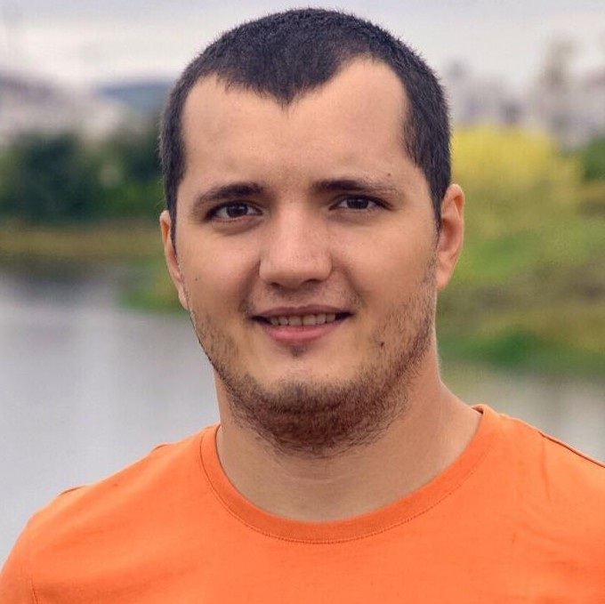

# Мое портфолио

## Обо мне

Привет! Меня зовут Михаил, я являюсь студентом Нетологии. Изучаю курс Full Stack Developer on Python. Моя цель - стать специалистом в этой области и получить навыки работы с:

- Python
- Django
- SQL и базы данных
- HTML/CSS
- JavaScript
- React.js
- Git

**Связаться со мной:**

e-mail: zarmih@mail.ru

_Благодарю за внимание!_